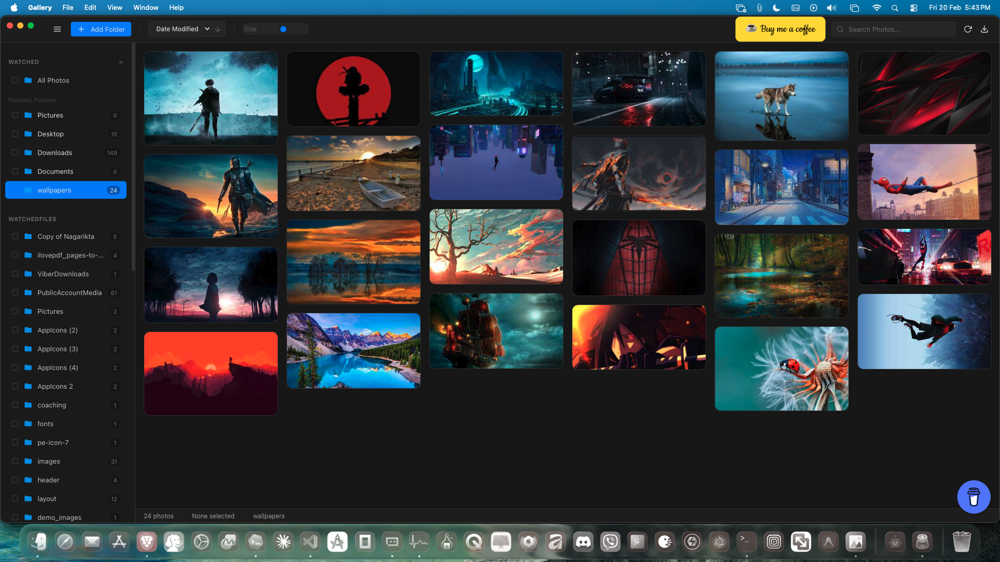
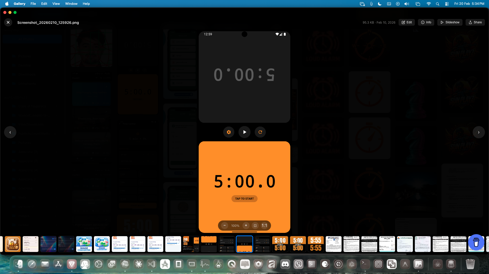
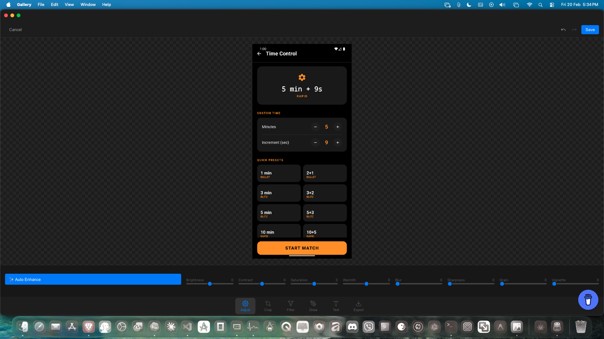
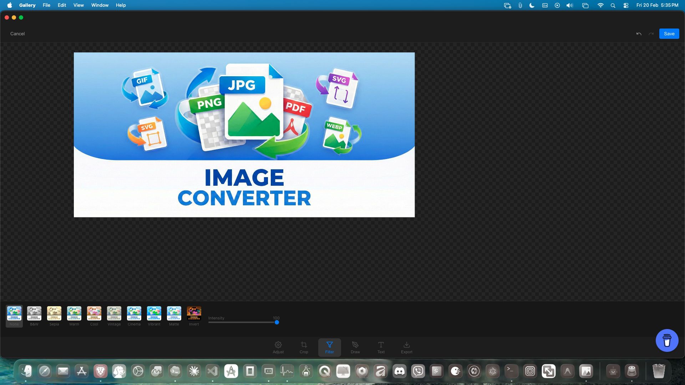
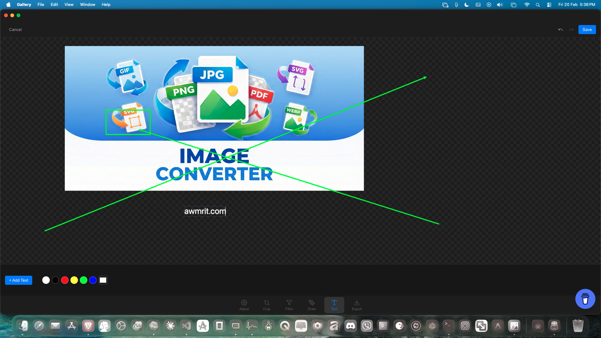

# Gallery

A modern, high-performance, and privacy-focused image gallery.

Built because the default macOS gallery didn't meet my needs for speed and flexibility. Gallery is designed to be fast, beautiful, and completely local.

## Screenshots

<div align="center">
  
  <br><br>
  
  <br><br>
  
  <br><br>
  
  <br><br>
  
  <br><br>
  
</div>

## Features

- **🚀 Blazing Fast**: Built with Electron and optimized for performance. Handles thousands of images effortlessly.
- **🔒 Private & Local**: Your photos never leave your device. No cloud syncing, no tracking.
- **✨ Masonry Grid**: View your collection in a stunning, responsive masonry layout.
- **🎨 Powerful Editor**: Built-in image editor with adjustments (brightness, contrast, saturation), filters, cropping, and drawing tools.
- **📂 Sidebar Navigation**: Organize and browse your folders with a native-feeling sidebar.
- **⌨️ Keyboard Shortcuts**: Navigate and edit with efficiency.
- **🌙 Dark Mode**: Sleek dark interface that's easy on the eyes.

## Installation

### Download
Download the latest version from the [Releases](https://github.com/iamawmrit/Image-Gallery/releases) page.

### Build from Source

Prerequisites: Node.js (v18+) and npm.

1. Clone the repository:
   ```bash
   git clone https://github.com/iamawmrit/Image-Gallery.git
   cd Image-Gallery
   ```

2. Install dependencies:
   ```bash
   npm install
   ```

3. Start the application in development mode:
   ```bash
   npm start
   ```

4. Build for production:

   **For macOS (DMG, PKG):**
   ```bash
   npm run dist -- --mac
   ```

   **For Windows (EXE):**
   *Note: Building for Windows requires a Windows machine or Wine installed on macOS/Linux.*
   ```bash
   npm run dist -- --win
   ```

## Contributing

Contributions are welcome! Whether it's bug reports, feature requests, or code contributions, please feel free to reach out.

1. Fork the project
2. Create your feature branch (`git checkout -b feature/AmazingFeature`)
3. Commit your changes (`git commit -m 'Add some AmazingFeature'`)
4. Push to the branch (`git push origin feature/AmazingFeature`)
5. Open a Pull Request

## License

Distributed under the MIT License. See `LICENSE` for more information.

---

Made with ❤️ by [awmrit.com](https://awmrit.com)
